# 🖥️ Active Directory Lab – DC01 / lab.local

> Oppsett av en Domain Controller med **Windows Server 2022** på **Oracle VirtualBox** — inkludert AD DS, DNS, brukere, grupper og Group Policy.


---

## 📋 Innholdsfortegnelse

- [1. Virtuell maskin – oppretting og konfigurasjon](#1-virtuell-maskin--oppretting-og-konfigurasjon)
- [2. Windows Server grunnoppsett](#2-windows-server-grunnoppsett)
- [3. Installasjon av Active Directory](#3-installasjon-av-active-directory)
- [4. DNS-konfigurasjon](#4-dns-konfigurasjon)
- [5. Organisasjonsstruktur i AD](#5-organisasjonsstruktur-i-ad)
- [6. Group Policy Management](#6-group-policy-management)
- [7. Oppsummering](#7-oppsummering)

---

## 1. Virtuell maskin – oppretting og konfigurasjon

### 1.1 Navn og operativsystem

En ny VM ble opprettet i VirtualBox med følgende innstillinger:

| Innstilling | Verdi |
|---|---|
| Navn | `DC01` |
| Type | Microsoft Windows |
| Versjon | Windows 2022 (64-bit) |
| Mappe | `C:\Users\anhy_\VirtualBox VMs` |
| ISO | `SERVER_EVAL_x64FRE_en-us.iso` |

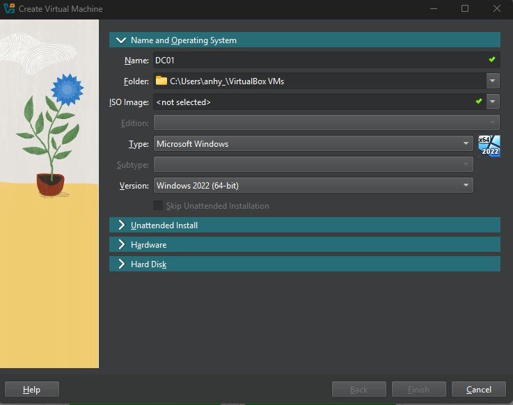
*Figur 1 – VirtualBox: Navn og operativsystem for DC01*

---

### 1.2 Hardware-innstillinger

| Innstilling | Verdi |
|---|---|
| RAM | 4096 MB (4 GB) |
| Prosessorer | 4 CPU-kjerner |
| EFI | Deaktivert |

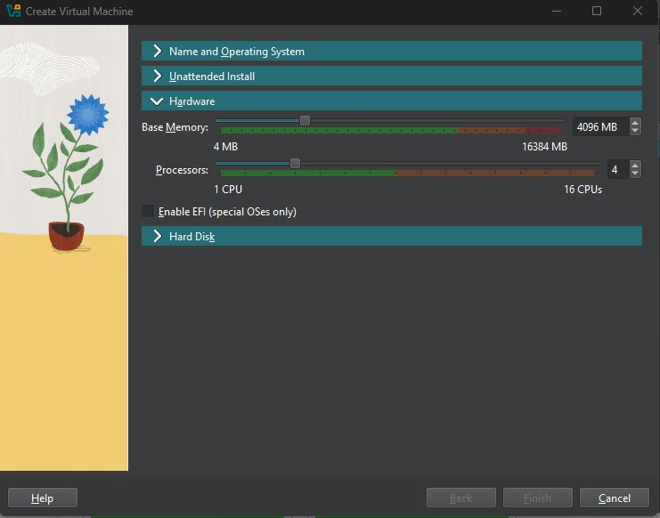
*Figur 2 – Hardware: 4 GB RAM og 4 CPU-kjerner*

---

### 1.3 Lagring

ISO-filen ble montert som optisk disk under SATA-kontrolleren, sammen med den virtuelle harddisken `DC01.vdi`.

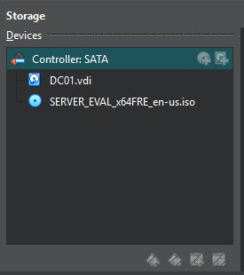
*Figur 3 – SATA-kontroller med DC01.vdi og ISO*

---

### 1.4 Nettverksinnstillinger

Nettverkskortet ble satt til **Bridged Adapter** mot `Intel(R) Ethernet Connection (7) I219-V`, som gir VM-en direkte tilgang til det fysiske nettverket.

| Innstilling | Verdi |
|---|---|
| Attached to | Bridged Adapter |
| Adapter | Intel(R) Ethernet Connection (7) I219-V |
| Promiscuous Mode | Deny |

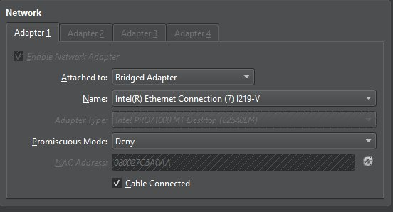
*Figur 4 – Nettverkskort konfigurert som Bridged Adapter*

---

### 1.5 VM kjører

Etter installasjon viser VirtualBox Manager at DC01 har status **Running**.

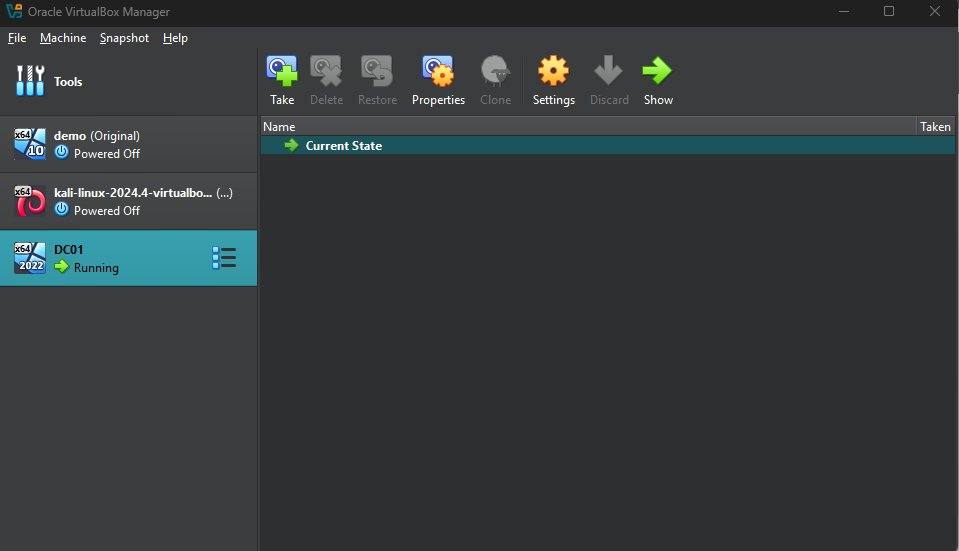
*Figur 5 – DC01 kjører i VirtualBox Manager*

---

## 2. Windows Server grunnoppsett

Etter installasjon av Windows Server 2022 ble maskinen navngitt `DC01`. Den var initialt del av standard arbeidsgruppen **WORKGROUP** før promotering til Domain Controller.

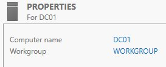
*Figur 6 – Systemegenskaper viser DC01 i WORKGROUP*

---

## 3. Installasjon av Active Directory

### 3.1 AD-verktøy i Server Manager

Etter installasjon av **AD DS**-rollen ble en rekke verktøy tilgjengelige via `Server Manager → Tools`:

- Active Directory Users and Computers
- Active Directory Domains and Trusts
- Group Policy Management
- DNS Manager
- ADSI Edit

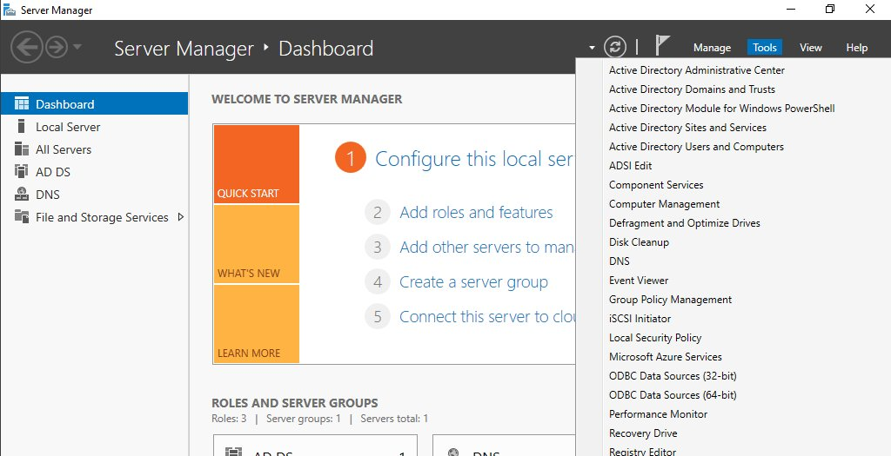
*Figur 7 – Server Manager med tilgjengelige AD-verktøy*

---

### 3.2 Deployment – nytt skogdomene

Under konfigurasjonsveiviseren ble **Add a new forest** valgt med rotdomenet satt til `lab.local`.

| Innstilling | Verdi |
|---|---|
| Operasjon | Add a new forest |
| Root domain name | `lab.local` |
| Target server | DC01 |

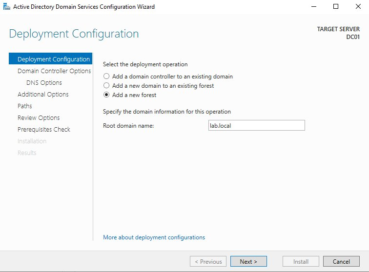
*Figur 8 – AD DS-veiviser: Opprette nytt skogdomene lab.local*

---

## 4. DNS-konfigurasjon

DNS er kritisk for Active Directory — klienter bruker DNS for å lokalisere Domain Controllers og andre tjenester i domenet. DNS Manager ble åpnet via `Tools → DNS` i Server Manager.

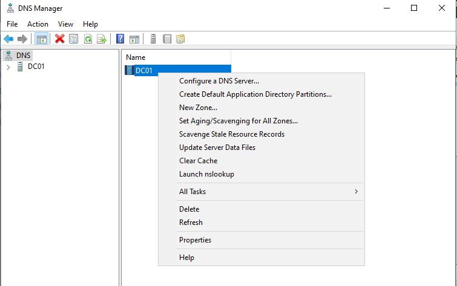
*Figur 9 – DNS Manager med kontekstmeny for DC01*

---

## 5. Organisasjonsstruktur i AD

### 5.1 Opprette objekter

I **Active Directory Users and Computers** ble det høyreklikket på `lab.local → New` for å opprette nye objekter som Organizational Units, brukere og grupper.

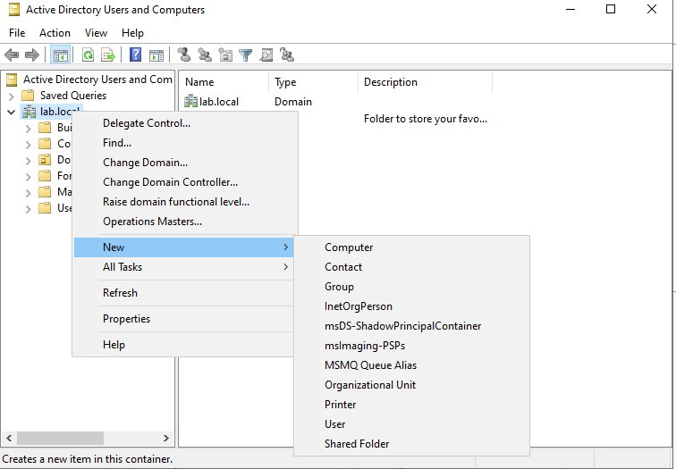
*Figur 10 – Opprette nye AD-objekter under lab.local*

---

### 5.2 Organizational Units

Det ble opprettet to egendefinerte OU-er under `lab.local`:

| OU | Innhold |
|---|---|
| `Brukere` | Brukerkontoer |
| `Groups` | Sikkerhetsgrupper |

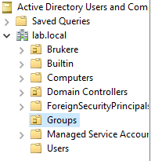
*Figur 11 – Oversikt over lab.local med OU-ene Brukere og Groups*

---

### 5.3 Sikkerhetsgrupper

To sikkerhetsgrupper ble opprettet i `Groups`-OU:

| Gruppe | Type |
|---|---|
| `HR` | Security Group |
| `IT` | Security Group |

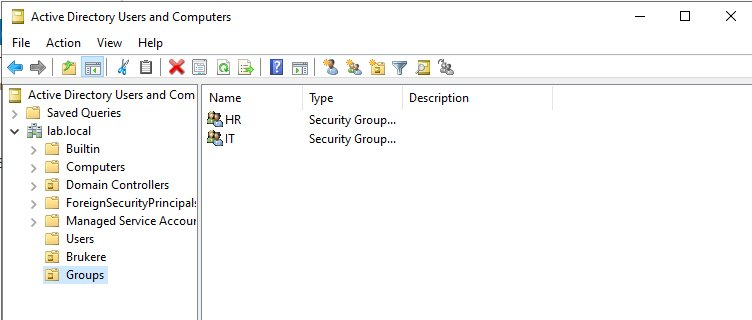
*Figur 12 – Sikkerhetsgruppene HR og IT*

---

### 5.4 Brukerkontoer

To brukere ble opprettet i `Brukere`-OU:

| Bruker | Type |
|---|---|
| John Doe | User |
| Alice Smith | User |

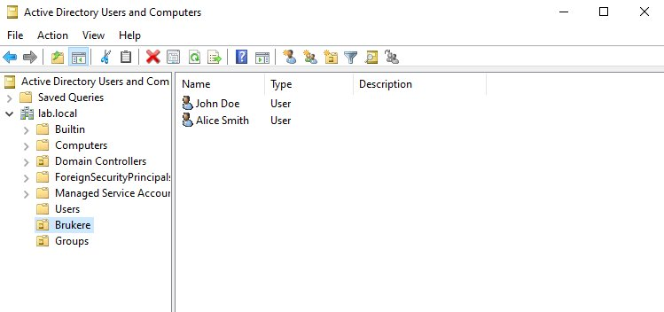
*Figur 13 – John Doe og Alice Smith i Brukere-OU*

---

### 5.5 Gruppemedlemskap

**John Doe** ble lagt til som medlem i `HR`-gruppen.

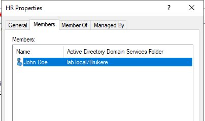
*Figur 14 – HR Properties: John Doe er medlem (lab.local/Brukere)*

---

## 6. Group Policy Management

### 6.1 Default Domain Policy

**Default Domain Policy** ble redigert via `Group Policy Management → lab.local → Default Domain Policy → Edit`. Policyen er koblet til `lab.local` og er aktivert.

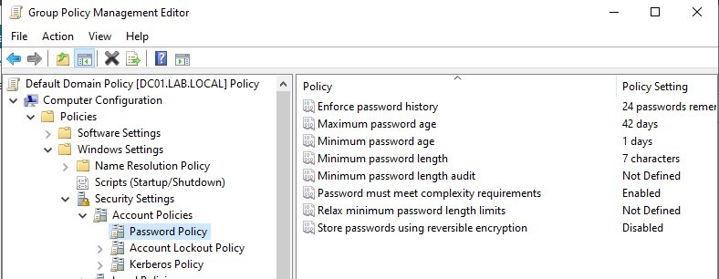
*Figur 15 – Group Policy Management: Redigere Default Domain Policy*

---

### 6.2 Password Policy

Under `Computer Configuration → Policies → Windows Settings → Security Settings → Account Policies → Password Policy` ble følgende konfigurert:

| Policy | Verdi |
|---|---|
| Enforce password history | 24 passwords |
| Maximum password age | 42 days |
| Minimum password age | 1 day |
| Minimum password length | 7 characters |
| Password must meet complexity requirements | Enabled |
| Store passwords using reversible encryption | Disabled |

---

## 7. Oppsummering

Prosjektet demonstrerer et komplett Active Directory-miljø satt opp fra bunnen av med VirtualBox.

### ✅ Fullførte steg

- [x] Opprettet VM (DC01) med 4 GB RAM og 4 CPU-kjerner
- [x] Installert Windows Server 2022 med Bridged Adapter-nettverk
- [x] Promotert serveren til Domain Controller for `lab.local`
- [x] Konfigurert DNS for domenet
- [x] Opprettet OU-er: `Brukere` og `Groups`
- [x] Opprettet brukere: John Doe og Alice Smith
- [x] Opprettet grupper: HR og IT
- [x] Lagt John Doe til som medlem av HR-gruppen
- [x] Konfigurert Group Policy med passordbegrensninger


## Del 2

### 2.1 Koble klient til domenet (jdoe)

En ny VM med **Windows 10 Pro** ble opprettet og kalt `jdoe`. Denne maskinen ble koblet til domenet `lab.local` slik at brukeren John Doe kan logge inn med sin domenebruker.

---

### 2.2 Sette DNS til DC01

For at klientmaskinen skal finne domenet må DNS peke på DC01 sin IP-adresse. Dette gjøres via `Nettverkstilkoblinger → Ethernet → Egenskaper → TCP/IPv4`.

> **Foretrukket DNS-server** settes til IP-adressen til DC01 (f.eks. `192.168.x.x`).
> IP-adressen hentes automatisk (DHCP), men DNS settes manuelt.

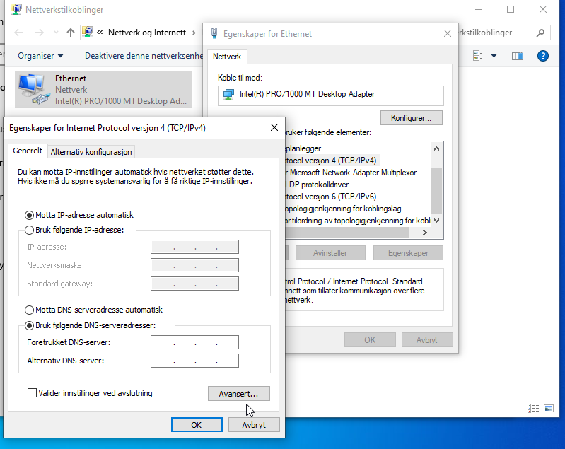
*Figur 16 – TCP/IPv4: DNS peker på DC01 sin IP-adresse*

---

### 2.3 Åpne systemegenskaper med sysdm.cpl

For å koble maskinen til domenet kjøres kommandoen `sysdm.cpl` via kjør-dialogen (`Win + R`). Dette åpner Systemegenskaper direkte.

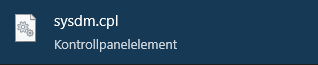
*Figur 17 – Kjører sysdm.cpl for å åpne Systemegenskaper*

---

### 7.3 Systemegenskaper – Datamaskinnavn

I **Systemegenskaper** vises at maskinen heter `DESKTOP-6BA1NP4` og er i `WORKGROUP`. Her trykkes **Endre...** for å koble til domenet.

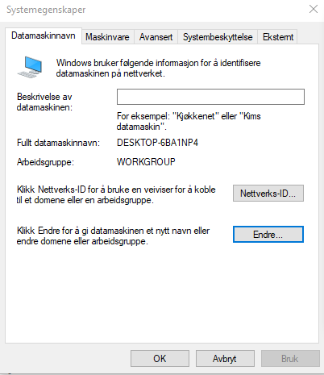
*Figur 18 – Systemegenskaper viser maskinen i WORKGROUP*

---

### 7.4 Bli medlem av domenet

I dialogboksen **Endringer i datamaskinnavn/-domene** velges **Domene** og `lab.local` skrives inn. Maskinen vil nå forsøke å kontakte DC01 og bli med i domenet.

| Innstilling | Verdi |
|---|---|
| Datamaskinnavn | `DESKTOP-6BA1NP4` |
| Medlem av | Domene |
| Domenenavn | `lab.local` |

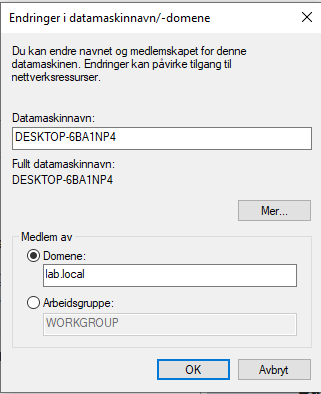
*Figur 19 – Kobler jdoe til domenet lab.local*

---

### 7.5 Autentisering med domeneadmin

Windows krever at en konto med tillatelse til å melde maskiner inn i domenet bekrefter operasjonen. Her brukes domenekontoen `LAB\Administrator`.

| Felt | Verdi |
|---|---|
| Brukernavn | `LAB\Administrator` |
| Passord | *(domenets administratorpassord)* |

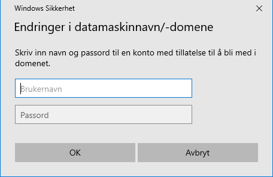
*Figur 20 – Autentisering med LAB\Administrator for å bli med i domenet*

> ✅ Etter vellykket autentisering bekrefter Windows at maskinen er lagt til i `lab.local`, og en omstart er nødvendig for at endringene skal tre i kraft.

---

## 8. Oppsummering

Prosjektet demonstrerer et komplett Active Directory-miljø satt opp fra bunnen av med VirtualBox, inkludert en klientmaskin koblet til domenet.

### ✅ Fullførte steg
- [x] Opprettet Windows 10 Pro klientmaskin (`jdoe`)
- [x] Satt DNS på klient til DC01 sin IP-adresse
- [x] Koblet klientmaskinen til domenet `lab.local` med `LAB\Administrator`


### 🗂️ Miljøoversikt

```
Forest: lab.local
└── Domain Controller: DC01 (Windows Server 2022)
    ├── Roles: AD DS, DNS
    ├── OU: Brukere
    │   ├── John Doe (jdoe)
    │   └── Alice Smith
    └── OU: Groups
        ├── HR  (members: John Doe)
        └── IT

Klientmaskiner:
└── jdoe (Windows 10 Pro) → medlem av lab.local
```

---

*Active Directory Lab · lab.local · DC01 · Windows Server 2022 · Oracle VirtualBox*
